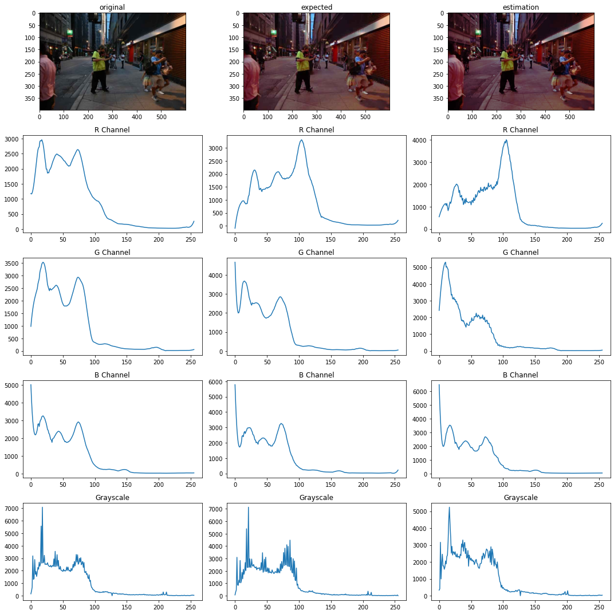
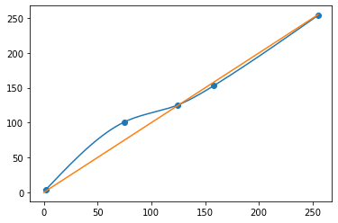
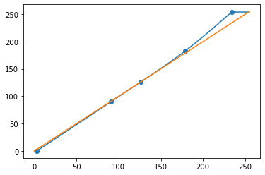
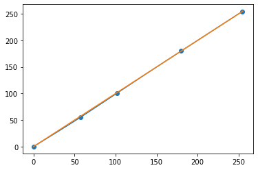

# Image Color Profile Learning

## Introduction:

This project used model two approaches to learn the color profile from a pair of original image and color profile filtered image. The first approach estimates the RGB channel histogram curves assuming the mount points are fixed. This approach works the best if the histogram of the original image is relatively evenly distributed. The second approach estimates the RGB channel histogram curves without the fixed mount point assumption. However, the second approach may result in over saturation in some of the color channels. 

  
   
  

## File Organization:

`filter_learning.ipynb`:

This file contains the sample experiments where curve learning approaches were learned and applied.

`learn.py`:

This file contains the core functions the will be used for model learning.

`utils.py`:

This file contains some of the ploting functions for image visualization.

## Run the code:

You can use `print_histogram`function to print the images and their histograms. It takes a list of image names (`isfn=True`), or a list of images (`isfn=False`), and a list of strings as the names for the images.

To load a image, you can use `img = Image(img_name)` to load image, and `img.curve_pointR` to get the R channel histogram.

### Initial Approach(not very useful):

Use `data1 = Data(folder_name)` to read from the images from a folder. `data1.getHistograms()` will calculate the RGB and gray channel histograms for all images in the `data1`.

To learn the linear transform, call `learn = Learn(data1, data2)` to initiate the model, and call `learn.learnFormHist()` to get the learn transformation from histogram. `learn.learnFormCDF()` is also implemented but the result is not very plausible.

Finally, to apply the filter, you can call `filtered = filterImage(learn.A, learn.A_R, learn.A_G, learn.A_B, s_img, type="Hist")`, which return the filtered image.

### Curve Approach:
Use `source = Image(source_img_name)` and `target = Image(target_img_name)` to read the source and target image pair. Call `curve_pointR = optimize_curve(source.histogramR, target.histogramR)` for get the optimized curve point for each channel. 

Finally, call `filtered_basic = filterImage_curve(curve_pointR,curve_pointG,curve_pointB, source_img_name)` to apply RGB curves on image with name `source_img_name`.

### Advanced Curve Approach:
Loading image is the same as Curve Approach, but call `mountR, curve_pointR = optimize_advance_curve(source.histogramR, target.histogramR)` To get the optimized mount and curve points. 

Finally, call `filtered = filterImage_curve_advanced([curve_pointR,curve_pointG,curve_pointB],[mountR, mountG, mountB], source_img_name)` to apply the mount and curve points on image `source_img_name`.
